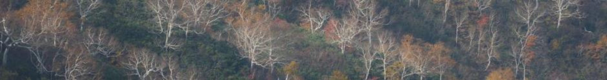

<link rel="stylesheet" href="https://cdn.jsdelivr.net/gh/jpswalsh/academicons@1/css/academicons.min.css">
<link rel="stylesheet" href="academicicons/css/academicons.min.css"/>


```{r echo=FALSE}

```

```{r out.width='25%', out.extra='style="float:right; padding:20px"', echo=FALSE}
knitr::include_graphics("image/img1.png")
```
\
Shinichi Tatsumi, Ph.D. (辰巳晋一)

&emsp; Senior Researcher, Hokkaido Research Center, FFPRI  
&emsp; `r icons::fontawesome("envelope")` community.ecologist at gmail dot com  

Welcome to my research website. I am a community ecologist studying biodiversity across space and time. I currently work on numerical methods to disentangle the complexities underlying ecological community structure. I am also interested in applying community ecology thoery to ecosystem management.

\

### Publications

##### Preprints

* Iritani R, Ontiveros VJ, Alonso D, Capitan JA, Godsoe W, **Tatsumi S** (2022) Jaccard dissimilarity in stochastic community models based on the species-independence assumption. [*bioRxiv*](https://www.biorxiv.org/content/10.1101/2022.12.13.520233v2){target="_blank"}.

##### Peer-reviewed Articles

&emsp;2023

* **Tatsumi S**, Yamaguchi K, Furuya N (2023) ForestScanner: a mobile application for measuring and mapping trees with LiDAR-equipped iPhone and iPad. [*Methods in Ecology and Evolution*](https://besjournals.onlinelibrary.wiley.com/doi/full/10.1111/2041-210X.13900){target="_blank"}. in press. [`r icons::fontawesome("file-pdf")`](pdf/){target="_blank"}

&emsp;2022

* **Tatsumi S**, Iritani R, Cadotte MW (2022) Partitioning the temporal changes in abundance-based beta diversity into loss and gain components. [*Methods in Ecology and Evolution*](https://besjournals.onlinelibrary.wiley.com/doi/10.1111/2041-210X.13921){target="_blank"} 13(9): 2042–2048.

&emsp;2021

* **Tatsumi S**, Iritani R, Cadotte MW (2021) Temporal changes in spatial variation: partitioning the extinction and colonisation components of beta diversity. [*Ecology Letters*](https://onlinelibrary.wiley.com/doi/10.1111/ele.13720){target="_blank"} 24(5): 1063–1072.

* **Tatsumi S**, Matsuoka S, Fujii S, Makoto K, Osono T, Isbell F, Mori AS (2021) Prolonged impacts of past agriculture and ungulate overabundance on soil fungal communities in restored forests. [*Environmental DNA*](https://onlinelibrary.wiley.com/doi/10.1002/edn3.198){target="_blank"} 3(5): 930–939.

\

### CV

aaa

\

### 履歴書

aaa