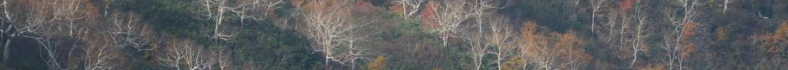
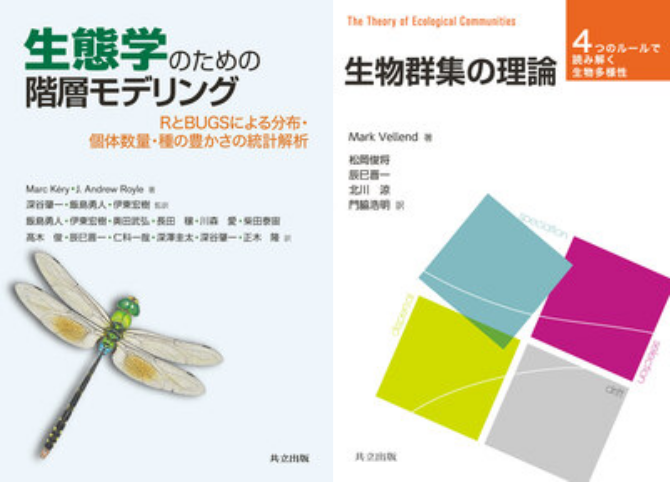

<link rel="stylesheet" href="https://cdn.jsdelivr.net/gh/jpswalsh/academicons@1/css/academicons.min.css">
<link rel="stylesheet" href="https://use.fontawesome.com/releases/v6.4.2/css/all.css">

<div class="lang-toggle">
<a href="/" class="btn btn-default btn-sm">English</a> <a href="/jpn" class="btn btn-primary btn-sm">日本語</a>
</div>

```{r out.width='100%', echo=FALSE}

```

```{r out.width='22%', out.extra='style="float:right; padding:2%"', echo=FALSE}

```

&emsp; `r icons::fontawesome("briefcase")` &thinsp; 京都大学 大学院農学研究科 森林科学専攻 [森林生態学研究室](https://www.rfecol.kais.kyoto-u.ac.jp/){target="_blank"} 准教授  
&emsp; `r icons::fontawesome("envelope")` &thinsp; community.ecologist at gmail dot com  

専門は群集生態学です。樹木群集の多種共存と生態系機能について、長期モニタリング・操作実験・理論的アプローチを組み合わせて研究しています。基礎科学としての群集生態学に立脚して、「森林伐採や気候変動などの人為的要因が多種共存に与える影響」や「生物多様性と森林生産性の関係」といった、森林管理への応用を見据えたテーマに取り組んでいます。\
Research Mapは[こちら](https://researchmap.jp/shin1.ta23){target="_blank"}をご覧ください。

<div style="text-align: center;">
[<i class="ai ai-google-scholar ai-2x"></i>](https://scholar.google.co.jp/citations?hl=ja&user=u4JoW-sAAAAJ&view_op=list_works&sortby=pubdate "Google Scholar"){target="_blank"}
&ensp; [<i class="ai ai-clarivate ai-2x"></i>](https://www.webofscience.com/wos/author/record/1641352 "Clarivate"){target="_blank"}
&ensp; [<i class="ai ai-figshare ai-2x"></i>](https://figshare.com/authors/Shinichi_Tatsumi/11650492 "Figshare"){target="_blank"}
&ensp; [<i class="ai ai-orcid ai-2x"></i>](https://orcid.org/0000-0002-1789-1685 "ORCID"){target="_blank"}
&ensp; [<i class="fab fa-x-twitter fa-2x"></i>](https://twitter.com/ShinichiTatsumi "X"){target="_blank"}
&ensp; [<i class="fab fa-github fa-2x"></i>](https://github.com/communityecologist "GitHub"){target="_blank"}
</div>

### 出版物

---

##### **プレプリント**

* Daido Y, Konrai K, Onoda Y, **Tatsumi S** (2026) Thermophilization, climatic debt, and consequent declines in primary productivity. [*bioRxiv*](https://www.biorxiv.org/content/10.64898/2026.04.28.721369){target="_blank"} 10.64898/2026.04.28.721369.

* **Tatsumi S**, Punwasi N, Roberto A, Cadotte MW (2023) Response diversity is key to buffer ecosystem productivity against multiple environmental change drivers. [*bioRxiv*](https://www.biorxiv.org/content/10.1101/2023.08.20.554000v1){target="_blank"} 10.1101/2023.08.20.554000.

---

##### **査読付き論文**

&emsp;2026

* Ma W, Hu J, Luo W, Lü X, Liang X, Zhang B, Yu Q, Han X, **Tatsumi S**, Wang Z, Hautier Y (2026) Demographic and growth dynamics jointly shape grassland productivity under extreme drought. [*Global Change Biology*](https://onlinelibrary.wiley.com/doi/10.1111/gcb.71016){target="_blank"} 32(7): e71016.

* Yao J, Li X, **Tatsumi S**, Ding Y, Huang J, Xu Y, Zhang Z, Long W, Zang R (2026) Scale dependence of woody plant β-diversity in a tropical rainforest metacommunity. [*Ecology and Evolution*](https://onlinelibrary.wiley.com/doi/10.1002/ece3.74022){target="_blank"} 16(7): e74022.

&emsp;2025

* Iritani R, Ontiveros VJ, Alonso D, Capitán JA, Godsoe W, **Tatsumi S** (2025) Jaccard dissimilarity in stochastic community models based on the species-independence assumption. [*Ecography*](https://nsojournals.onlinelibrary.wiley.com/doi/10.1002/ecog.07737){target="_blank"} 2025(8): e07737.

* Hrdina M, Molina-Valero JA, Kuželka K, **Tatsumi S**, Yamaguchi K, Melichová Z, Mokroš M, Surový P (2025) Obtaining the highest quality from a low-cost mobile scanner: a comparison of several pipelines with a new scanning device. [*Remote Sensing*](https://www.mdpi.com/2072-4292/17/15/2564){target="_blank"} 17(15): 2564.

* Cadotte MW, **Tatsumi S** (2025) Uncovering the mechanisms underpinning divergent environmental change impacts on biodiversity and ecosystem functioning. [*Ecology*](https://esajournals.onlinelibrary.wiley.com/doi/10.1002/ecy.70040){target="_blank"} 106(2): e70040.

* Oikawa N, Nakagawa Y, Owari T, **Tatsumi S**, Suzuki SN (2025) Utilising LiDAR-equipped iPhone in forestry: constructing 3D models and measuring tree sizes in a planting site. [*Ecological Solutions and Evidence*](https://besjournals.onlinelibrary.wiley.com/doi/10.1002/2688-8319.12399){target="_blank"} 6(1): e12399.

&emsp;2024

* Barrilli GHC, **Tatsumi S**, De Biasi JB, Cruz ARS, de Oliveira TCT, Hostim-Silva M, Hackradt C, Félix-Hackradt FCF (2024) Simplified fish larval supply in coastal areas after a dam burst in Brazil. [*Marine Pollution Bulletin*](https://www.sciencedirect.com/science/article/pii/S0025326X24005927){target="_blank"} 205: 116615.

* Naka M, Masumoto S, Nishizawa K, Matsuoka S, **Tatsumi S**, Kobayashi Y, Suzuki KF, Xu X, Kawakami T, Katayama N, Makoto K, Okada K, Uchida M, Takagi K, Mori AS (2024) Long-term consequences on soil fungal community structure: monoculture planting and natural regeneration. [*Environmental Management*](https://link.springer.com/article/10.1007/s00267-023-01917-7){target="_blank"} 73(4): 777–787. [`r icons::fontawesome("file-pdf")`](pdf/Naka_2024_EnvironManage.pdf){target="_blank"}

&emsp;2023

* **Tatsumi S**, Loreau M (2023) Partitioning the biodiversity effects on productivity into density and size components. [*Ecology Letters*](https://onlinelibrary.wiley.com/doi/full/10.1111/ele.14300){target="_blank"} 26(11): 1963–1973. [`r icons::fontawesome("file-pdf")`](pdf/Tatsumi_2023_EcolLett.pdf){target="_blank"}

* **Tatsumi S**, Yamaguchi K, Furuya N (2023) ForestScanner: a mobile application for measuring and mapping trees with LiDAR-equipped iPhone and iPad. [*Methods in Ecology and Evolution*](https://besjournals.onlinelibrary.wiley.com/doi/full/10.1111/2041-210X.13900){target="_blank"} 14(7): 1603–1609. [`r icons::fontawesome("file-pdf")`](pdf/Tatsumi_2023_MethodsEcolEvol.pdf){target="_blank"}

* **Tatsumi S**, Ohgue T, Azuma WA, Nishizawa K (2023) Bark traits affect epiphytic bryophyte community assembly in a temperate forest. [*Plant Ecology*](https://link.springer.com/article/10.1007/s11258-023-01363-9){target="_blank"} 224(12): 1089–1095. [`r icons::fontawesome("file-pdf")`](pdf/Tatsumi_2023_PlantEcol.pdf){target="_blank"}

&emsp;2022

* **Tatsumi S**, Iritani R, Cadotte MW (2022) Partitioning the temporal changes in abundance-based beta diversity into loss and gain components. [*Methods in Ecology and Evolution*](https://besjournals.onlinelibrary.wiley.com/doi/10.1111/2041-210X.13921){target="_blank"} 13(9): 2042–2048. [`r icons::fontawesome("file-pdf")`](pdf/Tatsumi_2022_MethodsEcolEvol.pdf){target="_blank"}

&emsp;2021

* **Tatsumi S**, Iritani R, Cadotte MW (2021) Temporal changes in spatial variation: partitioning the extinction and colonisation components of beta diversity. [*Ecology Letters*](https://onlinelibrary.wiley.com/doi/10.1111/ele.13720){target="_blank"} 24(5): 1063–1072. [`r icons::fontawesome("file-pdf")`](pdf/Tatsumi_2021_EcolLett.pdf){target="_blank"}

* **Tatsumi S**, Matsuoka S, Fujii S, Makoto K, Osono T, Isbell F, Mori AS (2021) Prolonged impacts of past agriculture and ungulate overabundance on soil fungal communities in restored forests. [*Environmental DNA*](https://onlinelibrary.wiley.com/doi/10.1002/edn3.198){target="_blank"} 3(5): 930–939. [`r icons::fontawesome("file-pdf")`](pdf/Tatsumi_2021_EnvironDNA.pdf){target="_blank"}

* Suzuki KF, Kobayashi Y, Seidl R, Senf C, **Tatsumi S**, Koide D, Azuma WA, Higa M, Koyanagi TF, Qian S, Kusano Y, Matsubayashi R, Mori AS (2021) The potential role of an alien tree species in supporting forest restoration: lessons from Shiretoko National Park, Japan. [*Forest Ecology and Management*](https://www.sciencedirect.com/science/article/pii/S0378112721003418?via%3Dihub){target="_blank"} 493: 119253. [`r icons::fontawesome("file-pdf")`](pdf/Suzuki_2021_ForEcolManage.pdf){target="_blank"}

* Sookhan N, Lorenzo A, **Tatsumi S**, Yuen M, MacIvor JS (2021) Linking bacterial diversity to floral identity in the bumble bee pollen basket. [*Environmental DNA*](https://onlinelibrary.wiley.com/doi/full/10.1002/edn3.165){target="_blank"} 3(3): 669–680. [`r icons::fontawesome("file-pdf")`](pdf/Sookhan_2021_EnvironDNA.pdf){target="_blank"}

&emsp;2020

* **Tatsumi S**, Strengbom J, Čugunovs M, Kouki J (2020) Partitioning the colonization and extinction components of beta diversity across disturbance gradients. [*Ecology*](https://esajournals.onlinelibrary.wiley.com/doi/abs/10.1002/ecy.3183){target="_blank"} 101(12): e03183. [`r icons::fontawesome("file-pdf")`](pdf/Tatsumi_2020_Ecology.pdf){target="_blank"}

* **Tatsumi S** (2020) Tree diversity effects on forest productivity increase through time because of spatial partitioning. [*Forest Ecosystems*](https://forestecosyst.springeropen.com/articles/10.1186/s40663-020-00238-z){target="_blank"} 7: 24. [`r icons::fontawesome("file-pdf")`](pdf/Tatsumi_2020_ForEcosyst.pdf){target="_blank"}

* Malloch B, **Tatsumi S**, Seibold S, Cadotte MW, MacIvor JS (2020) Urbanization and plant invasion alter the structure of litter microarthropod communities. [*Journal of Animal Ecology*](https://besjournals.onlinelibrary.wiley.com/doi/10.1111/1365-2656.13311){target="_blank"} 89(11): 2496–2507. [`r icons::fontawesome("file-pdf")`](pdf/Malloch_2020_JAnimEcol.pdf){target="_blank"}

&emsp;2019

* **Tatsumi S**, Cadotte MW, Mori AS (2019) Individual-based models of community assembly: neighborhood competition drives phylogenetic community structure. [*Journal of Ecology*](https://besjournals.onlinelibrary.wiley.com/doi/10.1111/1365-2745.13074){target="_blank"} 107(2): 735–746. [`r icons::fontawesome("file-pdf")`](pdf/Tatsumi_2019_JEcol.pdf){target="_blank"}

* Cadotte MW, Carboni M, Si X, **Tatsumi S** (2019) Do traits and phylogeny support congruent community diversity patterns and assembly inferences? [*Journal of Ecology*](https://besjournals.onlinelibrary.wiley.com/doi/full/10.1111/1365-2745.13247){target="_blank"} 107(5): 2065–2077. [`r icons::fontawesome("file-pdf")`](pdf/Cadotte_2019_JEcol.pdf){target="_blank"}

&emsp;2018

* Pasanen H, Junninen K, Boberg J, **Tatsumi S**, Stenlid J, Kouki J (2018) Life after tree death: does restored dead wood host different fungal communities to natural woody substrates? [*Forest Ecology and Management*](https://www.sciencedirect.com/science/article/pii/S0378112717306448){target="_blank"} 409: 863–871. [`r icons::fontawesome("file-pdf")`](pdf/Pasanen_2018_ForEcolManage.pdf){target="_blank"}

&emsp;2017

* **Tatsumi S**, Ohgue T, Azuma A, Tuovinen V, Imada Y, Mori AS, Thor G, Ranlund Å (2017) Tree hollows can affect epiphyte species composition. [*Ecological Research*](https://link.springer.com/article/10.1007/s11284-017-1468-x){target="_blank"} 32(4): 503–509. [`r icons::fontawesome("file-pdf")`](pdf/Tatsumi_2017_EcolRes.pdf){target="_blank"}

* Mori AS, **Tatsumi S**, Gustafsson L (2017) Landscape properties affect biodiversity response to retention approaches in forestry. [*Journal of Applied Ecology*](https://besjournals.onlinelibrary.wiley.com/doi/full/10.1111/1365-2664.12888){target="_blank"} 54(6): 1627–1637. [`r icons::fontawesome("file-pdf")`](pdf/Mori_2017_JApplEcol.pdf){target="_blank"}

&emsp;2016

* **Tatsumi S**, Owari T, Mori AS (2016) Estimating competition coefficients in tree communities: a hierarchical Bayesian approach to neighborhood analysis. [*Ecosphere*](https://esajournals.onlinelibrary.wiley.com/doi/full/10.1002/ecs2.1273){target="_blank"} 7(3): e01273. [`r icons::fontawesome("file-pdf")`](pdf/Tatsumi_2016_Ecosphere.pdf){target="_blank"}

* Nishizawa K, **Tatsumi S**, Kitagawa R, Mori AS (2016) Deer herbivory affects the functional diversity of forest floor plants via changes in competition-mediated assembly rules. [*Ecological Research*](https://link.springer.com/article/10.1007/s11284-016-1367-6){target="_blank"} 31(4): 569–578. [`r icons::fontawesome("file-pdf")`](pdf/Nishizawa_2016_EcolRes.pdf){target="_blank"}

* Owari T, Okamura K, Fukushi K, Kasahara H, **Tatsumi S** (2016) Single-tree management for high-value timber species in a cool-temperate mixed forest in northern Japan. [*IJBSESM*](https://www.tandfonline.com/doi/full/10.1080/21513732.2016.1163734){target="_blank"} 12(1–2): 74–82. [`r icons::fontawesome("file-pdf")`](pdf/Owari_2016_IJBSESM.pdf){target="_blank"}

&emsp;2015

* Mori AS, Qian S, **Tatsumi S** (2015) Academic inequality through the lens of community ecology: a meta-analysis. [*PeerJ*](https://peerj.com/articles/1457/){target="_blank"} 3: e1457. [`r icons::fontawesome("file-pdf")`](pdf/Mori_2015_PeerJ.pdf){target="_blank"}

* Owari T, **Tatsumi S**, Ning L, Yin M (2015) Height growth of Korean pine seedlings planted under strip-cut larch plantations in northeast China. [*International Journal of Forestry Research*](https://www.hindawi.com/journals/ijfr/2015/178681/){target="_blank"}: Art 178681. [`r icons::fontawesome("file-pdf")`](pdf/Owari_2015_IntJForRes.pdf){target="_blank"}

&emsp;2014

* **Tatsumi S**, Owari T, Yin M, Ning L (2014) Neighborhood analysis of underplanted Korean pine demography in larch plantations: implications for uneven-aged management in northeast China. [*Forest Ecology and Management*](https://www.sciencedirect.com/science/article/pii/S0378112714001765#){target="_blank"} 322: 10–18. [`r icons::fontawesome("file-pdf")`](pdf/Tatsumi_2014_ForEcolManage.pdf){target="_blank"}

* **Tatsumi S**, Owari T, Kasahara H, Nakagawa Y (2014) Individual-level analysis of damage to residual trees after single-tree selection harvesting in northern Japanese mixedwood stands. [*Journal of Forest Research*](https://link.springer.com/article/10.1007/s10310-013-0418-x){target="_blank"} 19(4): 369–378. [`r icons::fontawesome("file-pdf")`](pdf/Tatsumi_2014_JForRes.pdf){target="_blank"}

&emsp;2013

* **Tatsumi S**, Owari T (2013) Modeling the effects of individual-tree size, distance, and species on understory vegetation based on neighborhood analysis. [*Canadian Journal of Forest Research*](https://cdnsciencepub.com/doi/full/10.1139/cjfr-2013-0111#.Uhy76hvvgrE){target="_blank"} 43(11): 1006–1014. [`r icons::fontawesome("file-pdf")`](pdf/Tatsumi_2013_CanJForRes.pdf){target="_blank"}

&emsp;2010

* Suzuki S, **Tatsumi S**, Ueno Y (2010) Multiple-criteria decision-support system for optimising spatial distribution in a forest classification process. [*Journal of Forest Planning*](https://www.jstage.jst.go.jp/article/jfp/16/1/16_KJ00007700339/_article){target="_blank"} 16(1): 17–26.

---

##### **書籍**

```{r out.width='30%', out.extra='style="float:right; padding-left:2%"', echo=FALSE}

```


* **辰巳晋一**（2021）「垂直（階層）構造」. 日本森林学会（編）. [森林学の百科事典](https://www.maruzen-publishing.co.jp/item/?book_no=303353){target="_blank"}. 丸善出版. 42–43頁.

* Marc Kéry・J. Andrew Royle（著）, 深谷肇一・飯島勇人・伊東宏樹（監訳）, 飯島勇人・伊東宏樹・奥田武弘・長田穣・川森愛・柴田泰宙・高木俊・**辰巳晋一**・仁科一哉・深澤圭太・深谷肇一・正木隆（訳）（2021）[生態学のための階層モデリング ―RとBUGSによる分布・個体数量・種の豊かさの統計解析―](https://www.kyoritsu-pub.co.jp/book/b10003301.html){target="_blank"}. 共立出版.

* Mark Vellend（著）, 松岡俊将・**辰巳晋一**・北川涼・門脇浩明（訳）（2019）[生物群集の理論 ―4つのルールで読み解く生物多様性―](https://www.kyoritsu-pub.co.jp/book/b10003154.html){target="_blank"}. 共立出版.

---

##### **その他の出版物**

* 西園朋広、細田和男、齋藤英樹、高橋正義、北原文章、山田祐亮、鄭峻介、志水克人、石橋聡、古家直行、**辰巳晋一**、小谷英司、松浦俊也、齋藤和彦、田中邦宏、田中真哉、福本桂子、近藤洋史、高橋與明、佐野真琴、鷹尾元（2023）平成28～令和2年度に調査した収穫試験地等固定試験地の経年成長データ (収穫試験報告 第27号). [森林総合研究所研究報告](https://www.jstage.jst.go.jp/article/ffpri/22/3/22_141/_article/-char/ja){target="_blank"} 22(3): 141–190.

* **辰巳晋一**（2021）多種混植による森林生産性の向上. 北の森だより 27: 2–3.

* **辰巳晋一**（2021）摩天楼と緑の街、トロント. 北方林業 72(3): 25–27.

* 石橋聡、古家直行、**辰巳晋一**（2019）北見地方天然林における洞爺丸台風風倒後の長期林分動態. 北方森林研究 67: 61–62.

* 橋本徹、伊藤江利子、梅村光俊、古家直行、**辰巳晋一**、石橋聡（2019）筋状地掻きで更新したダケカンバの立木位置と微地形の関係. 北方森林研究 67: 53–56.

* **辰巳晋一**（2019）ササ密度は中径針葉樹の下で薄い. 北方林業 70(1): 32–35.

* **辰巳晋一**（2016）単木情報を使った統計モデリング. [森林計画学会誌](https://www.jstage.jst.go.jp/article/jjfp/50/1/50_52/_article/-char/ja){target="_blank"} 50(1): 51–53.

* **辰巳晋一**（2015）カラマツ林に樹下植栽されたチョウセンゴヨウの動態モデリング：中国東北部における二段林施業に向けて. 広嶋卓也・吉本敦 編. 「森林計画・計測における統計理論の応用に係わる若手研究集会」資料集. pp. 10–12. (ISBN 978-4-915870-45-3)

* 尾張敏章、江口由典、宅間隆二、岡村行治、福岡哲、木村徳志、**辰巳晋一**（2015）択伐天然林の更新を補助するための精密植栽技術の開発 (予報). 北方森林研究 63: 81–84.

* Owari T, **Tatsumi S**, Ning L, Yin M (2014) Height growth of Korean pine saplings planted under strip-cut larch plantations in northeast China. *The International Forestry Review* 16(5): 366–367.

* Owari T, Okamura K, Fukushi K, Kasahara H, **Tatsumi S** (2014) Single-tree management for high-value timber species in a mixed conifer-hardwood forest in northern Japan. *The International Forestry Review* 16(5): 144.

* **Tatsumi S**, Owari T, Ohkawa A, Nakagawa Y (2013) Bayesian modeling of neighborhood competition in uneven-aged mixed-species stands. [*Formath*](https://www.jstage.jst.go.jp/article/formath/12/0/12_191/_article){target="_blank"} 12: 191–209.

* **Tatsumi S**, Owari T, Toyama K, Shiraishi N (2012) Adaptation of a spatially-explicit individual-based forest dynamics model SORTIE-ND to conifer-broadleaved mixed stands in the University of Tokyo Hokkaido Forest. [*Formath*](https://www.jstage.jst.go.jp/article/formath/11/0/11_1/_article){target="_blank"} 11: 1–26.

* 尾張敏章、福士憲司、広川俊英、井上崇、江口由典、**辰巳晋一**、美濃羽靖、中島徹（2012）林分施業法の選木技術：ウダイカンバ二次林の事例. 北方森林研究 60: 77–80.

* **Tatsumi S**, Owari T, Yamamoto H, Shiraishi N (2010) Forty-two years of stand structure development in a natural sub-boreal forest under selection system in central Hokkaido, Japan. *The International Forestry Review* 12(5): 87.

* **辰巳晋一**、尾張敏章、山本博一、白石則彦（2010）混交林択伐施業による42年間の林分構造の変化：東京大学北海道演習林の事例. 関東森林研究 61: 53–56.

---

### 履歴書

##### 職歴
* 2024年度–現在: 京都大学大学院 農学研究科 准教授
* 2020–2023年度: 国立研究開発法人 森林総合研究所 北海道支所 主任研究員
* 2019–2020年度: トロント大学 生物科学研究科 JSPS海外特別研究員
* 2018–2019年度: 国立研究開発法人 森林総合研究所 北海道支所 研究員
* 2017–2017年度: トロント大学 生物科学研究科 訪問研究員
* 2016–2016年度: 東フィンランド大学 森林科学科 訪問研究員
* 2015–2017年度: 横浜国立大学大学院 環境情報研究院 JSPS特別研究員 PD
* 2014–2014年度: 横浜国立大学大学院 環境情報研究院 技術補佐員
* 2012–2013年度: 東京大学大学院 農学生命科学研究科 JSPS特別研究員 DC2

##### 学歴
* 2011–2013年度: 東京大学大学院 農学生命科学研究科 森林科学専攻 博士課程
* 2009–2010年度: 東京大学大学院 農学生命科学研究科 森林科学専攻 修士課程
* 2005–2008年度: 東京農工大学 農学部 地域生態システム学科

##### 研究助成
* 2026–2028年度: JSPS 科学研究費助成事業 挑戦的研究（萌芽）（代表）
* 2025–2028年度: JSPS 科学研究費助成事業 基盤研究 B（代表）
* 2025–2027年度: 東京大学 SMBC 森林GXプロジェクト（分担）
* 2024–2025年度: JSPS 科学研究費助成事業 学術変革領域研究（A）公募研究（個人）
* 2022–2023年度: 林野庁 調査委託事業（分担）
* 2021–2024年度: JSPS 科学研究費助成事業 若手研究（個人）
* 2021–2021年度: スマート林業EZOモデル構築協議会 受託研究（分担）
* 2019–2020年度: JSPS 海外特別研究員（個人）
* 2018–2021年度: スウェーデン科学評議会 Vetenskapsrådet 研究費（分担）
* 2016–2018年度: JSPS 科学研究費助成事業 若手研究 B（個人）
* 2016–2016年度: プロ・ナトゥーラ・ファンド国内研究助成 （分担）
* 2016–2016年度: スカンジナビア・ニッポン ササカワ財団研究助成（代表）
* 2015–2017年度: JSPS 科学研究費助成事業 特別研究員奨励費 PD（個人）
* 2014–2014年度: クリタ水・環境科学振興財団 研究助成（分担）
* 2012–2013年度: JSPS 科学研究費助成事業 特別研究員奨励費 DC2（個人）
* 2012–2013年度: 東京大学 AGS研究助成（分担）
* 2011–2011年度: 日本科学協会 笹川科学研究助成（個人）

##### 賞罰
* 2025: 農学会 日本農学進歩賞
* 2020: トロント大学 生物科学研究科 Postdoc Paper of the Year 2019
* 2018: 第65回 日本生態学会 Best English Presentation Award
* 2018: 日本生態学会 Ecological Research Paper Award 2017
* 2016: 2015年度 森林計画学会 黒岩菊郎記念研究奨励賞
* 2014: 2013年度 東京大学大学院 農学生命科学研究科 研究科長賞（博士）
* 2014: 第61回 日本生態学会 優秀ポスター賞
* 2014: 2013年度 日本生態学会 北海道地区会 若手研究奨励賞
* 2013: 第124回 日本森林学会 学生ポスター賞
* 2012: 第123回 日本森林学会 学生ポスター賞
* 2012: 平成23年度 日本科学協会 笹川科学研究奨励賞

##### 委員
* 2025年度–現在: 文部科学省 科学技術・学術政策研究所 専門調査員
* 2025年度–現在: 日本森林学会 大会プログラム編成委員（植物生態部門）
* 2025–2025年度: 日本生態学会 第73回大会実行委員会 会計補佐
* 2023–現在: [*Journal of Ecology*](https://besjournals.onlinelibrary.wiley.com/journal/13652745){target="_blank"} 編集委員
* 2023–2023年度: 森林計画学会 北海道地区代表理事
* 2022–現在: [*Journal of Forest Research*](https://www.tandfonline.com/journals/tjfr20){target="_blank"} 編集委員
* 2020–現在: [*Ecological Solutions and Evidence*](https://besjournals.onlinelibrary.wiley.com/journal/26888319){target="_blank"} 編集委員
* 2020–2022年度: 日本生態学会 英語発表部会委員（21年度 副部会長, 22年度 部会長）
* 2011–2011年度: 第32回 関東生態学関係修論発表会委員

##### 査読経験
* Annals of Forest Science, Biological Conservation, Biological Invasions, Biological Reviews, Canadian Journal of Forest Research (2), Conservation Science and Practice (4), Diversity and Distributions, Ecography (3), Ecological Processes, Ecological Research (4), Ecology (4), Ecology and Evolution, Ecology Letters (5), Ecosphere, Forest Ecology and Management (4), Forestry Chronicle, Forests (4), Frontiers in Plant Science, Functional Ecology, Global Ecology and Biogeography, Journal of Animal Ecology, Journal of Applied Ecology (3), Journal of Biogeography (2), Journal of Ecology, Journal of Forest Research (2), Journal of Mountain Science, Journal of Plant Research (2), Journal of Sustainable Forestry, Journal of Vegetation Science (5), Landscape and Ecological Engineering, Methods in Ecology and Evolution, Nature Climate Change, Nature Ecology & Evolution, Oecologia (3), Plos One, Population Ecology, Progress in Earth and Planetary Science, Scientific Data, Scientific Reports (2), Swiss National Science Foundation, Trees Structure and Function, 森林計画学会誌 (3), 北方森林研究

* 査読/出版比 = **5.64**（査読した原稿79部 / 出版した筆頭論文14本）

